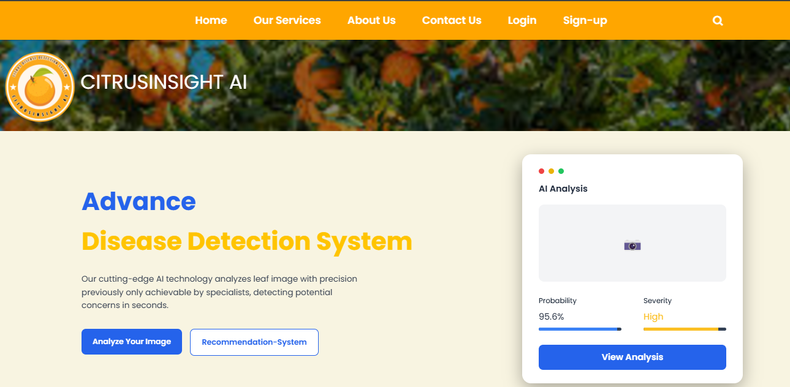
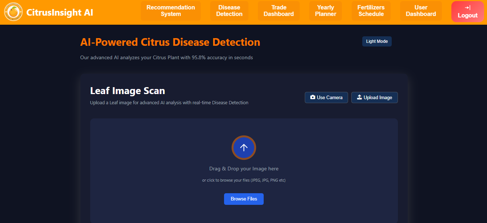
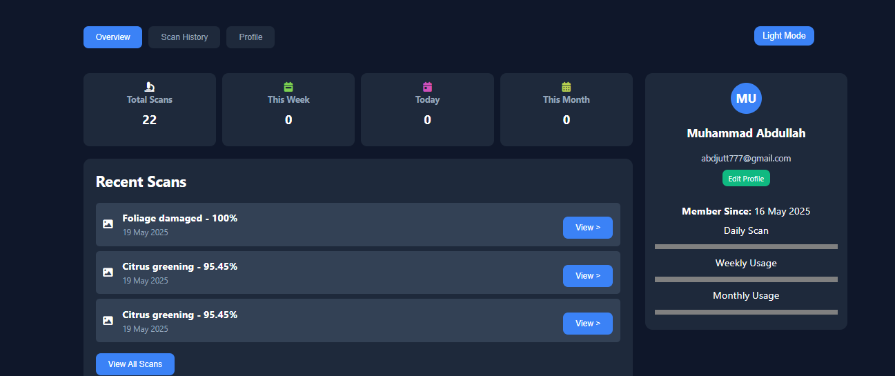
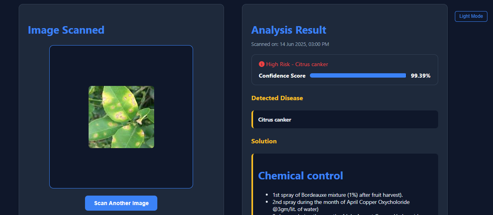
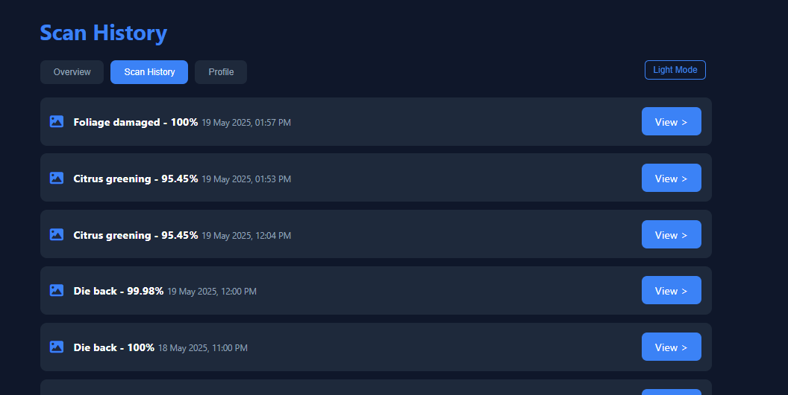
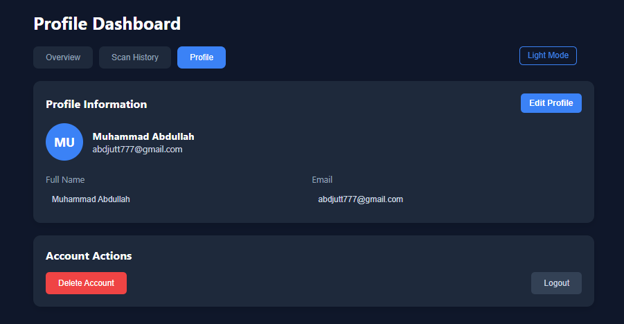

# 🍊 CitrusInsight AI

CitrusInsight AI is a full-stack, web-based intelligent system designed to detect and diagnose citrus leaf diseases using a machine learning model. Users can upload images of citrus leaves and receive disease predictions with confidence scores.

---

## 🌐 Project Features

* Web interface for citrus leaf disease detection
* Trained CNN-based ML model supporting 10 disease classes
* User authentication.
* Personalized user dashboards
* Scan history with timestamps and full image analysis
* Dynamic solution display based on detected disease

---

## 🧑‍💻 Author

**Muhammad Abdullah**
Email: [m.abdullah.3042@gmail.com](mailto:m.abdullah3042@gmail.com)
Location: Chiniot, Punjab, Pakistan

---

## 🤖 Machine Learning Model

* Dataset: 5,859 citrus leaf images
* Categories:

  * Citrus Canker
  * Citrus Greening
  * Citrus Mealybugs
  * Die Back
  * Foliage Damaged
  * Healthy Leaf
  * Powdery Mildew
  * Shot Hole
  * Spiny Whitefly
  * Yellow Leaves
* Frameworks Used: TensorFlow / PyTorch
* Metrics: Accuracy, Precision, Recall, F1-score, Confusion Matrix

---

## ⚙️ Tech Stack

* **Frontend:** HTML, CSS, JavaScript
* **Backend:** PHP
* **Database:** MySQL (via XAMPP)
* **Deployment:** Localhost (XAMPP), Model on Hugging Face

---

## 📂 Folder Structure

```
CitrusInsightAI/
├── citrus_model/        # Trained model and inference code
├── website/             # All frontend and PHP backend code
│   ├── index.html
│   ├── dashboard/
│   ├── scan_history/
│   ├── view/
├── docs/           
├── README.md
├── LICENSE
└── requirements.txt     
```

## 📸 Screenshots

### 🏠 Homepage


### 🖼️ Scan Upload Interface


### 📊 User Dashboard


### 📄 Report


### 🗂️ Scan History


### 👤 User Profile



---

## ⚡ How to Run Locally

1. Clone this repository:

   ```bash
   git clone https://github.com/m-abdullah-15/CitrusInsight-AI.git
   ```
2. Start XAMPP and enable Apache & MySQL.
3. Import `citrus_insight.sql` in phpMyAdmin.
4. Place the project folder in your `htdocs/` directory.
5. Visit `http://localhost/CitrusInsightAI/` in your browser.

---

## 🔒 License

This project is licensed under the **MIT License**. See the [LICENSE](./LICENSE) file for details.

---

## 📖 Acknowledgements

* Dataset collected from publicly available agricultural sources.
* Inspired by the need to assist farmers and agri-experts in identifying plant diseases efficiently.

---
